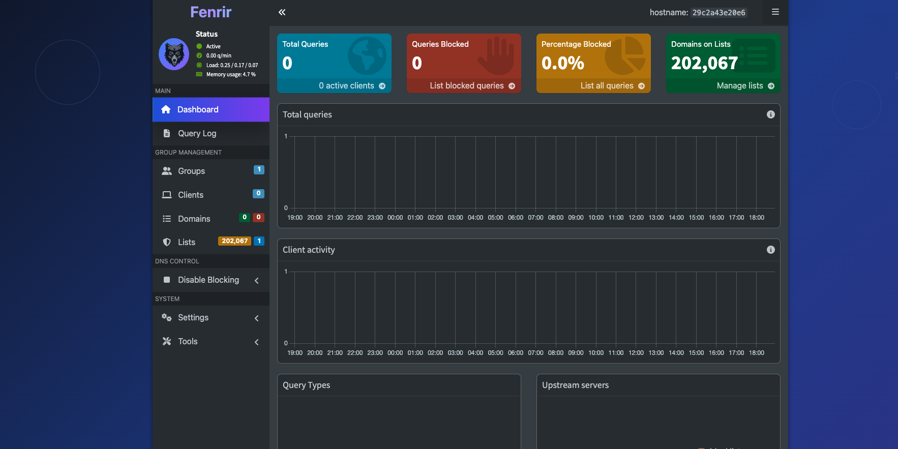

<div align="center">
  <a href="#">
    
  </a>
  <br>
  <strong>Network-wide DNS filtering with a custom Fenrir dashboard</strong>
  <br>
</div>

# Fenrir Web Interface



**Fenrir** is a customized web interface for [Pi-hole](https://github.com/pi-hole), with a new visual identity and UI adjustments inspired by the mythical wolf **Fenrir**, a symbol of strength and protection.

This fork replaces the original Pi-hole dashboard, adapting its look and feel to better fit my self-hosted ecosystem.

---

## ✨ Features

* 🔥 **Fully functional Pi-hole dashboard**
* 🐺 **Custom branding and design:** new icons, colors, and identity
* 🌙 **Dark theme by default**
* ⚙️ 100% compatible with Pi-hole's core features
* 📱 Fully responsive for desktop, tablet, and mobile

---

## 🚀 Installation

Fenrir Web Interface is a drop-in replacement for the Pi-hole web dashboard.

### 📦 Docker Example

If you're running Pi-hole via Docker, replace the default admin interface like this:

```yaml
services:
  fenrir:
    image: fenrir
    container_name: fenrir
    ports:
      - "53:53/tcp"
      - "53:53/udp"
      - "8080:80"
      - "443:443"
    environment:
      TZ: "America/Sao_Paulo"
      FTLCONF_webserver_api_password: "password"
    volumes:
      - ./data/etc-pihole/:/etc/pihole/
      - ./data/etc-dnsmasq.d/:/etc/dnsmasq.d/
    restart: unless-stopped
    build:
      context: .
      dockerfile: Dockerfile
```

Your `Dockerfile` should copy the Fenrir dashboard into the container:

```Dockerfile
FROM pihole/pihole:latest

RUN rm -rf /var/www/html/admin && mkdir -p /var/www/html/admin
RUN git clone https://github.com/kelwynOliveira/fenrir.git /var/www/html/admin
```

### 🖥️ Access the Web Interface

* `http://<IP_ADDRESS>:8080/admin/`
* Or via local DNS if configured: `http://fenrir.local/`

---

## 🧠 About This Project

This is a personal customization of the Pi-hole Web UI. The goal is purely aesthetic and thematic — bringing a unique identity to the dashboard without changing the core functionality.

* ✔️ 100% compatible with upstream Pi-hole
* 🔗 This repository only replaces the `pi-hole/web` component

---

## 💡 Credits

* Based on [Pi-hole Web](https://github.com/pi-hole/web)
* Original web UI built on [AdminLTE](https://github.com/ColorlibHQ/AdminLTE)
* Customizations, branding, and design by [Kelwyn](https://github.com/kelwynOliveira)

---

## ⚠️ Disclaimer

This project is **not affiliated with the official Pi-hole team**.
All trademarks, logos, and brand names are property of their respective owners.